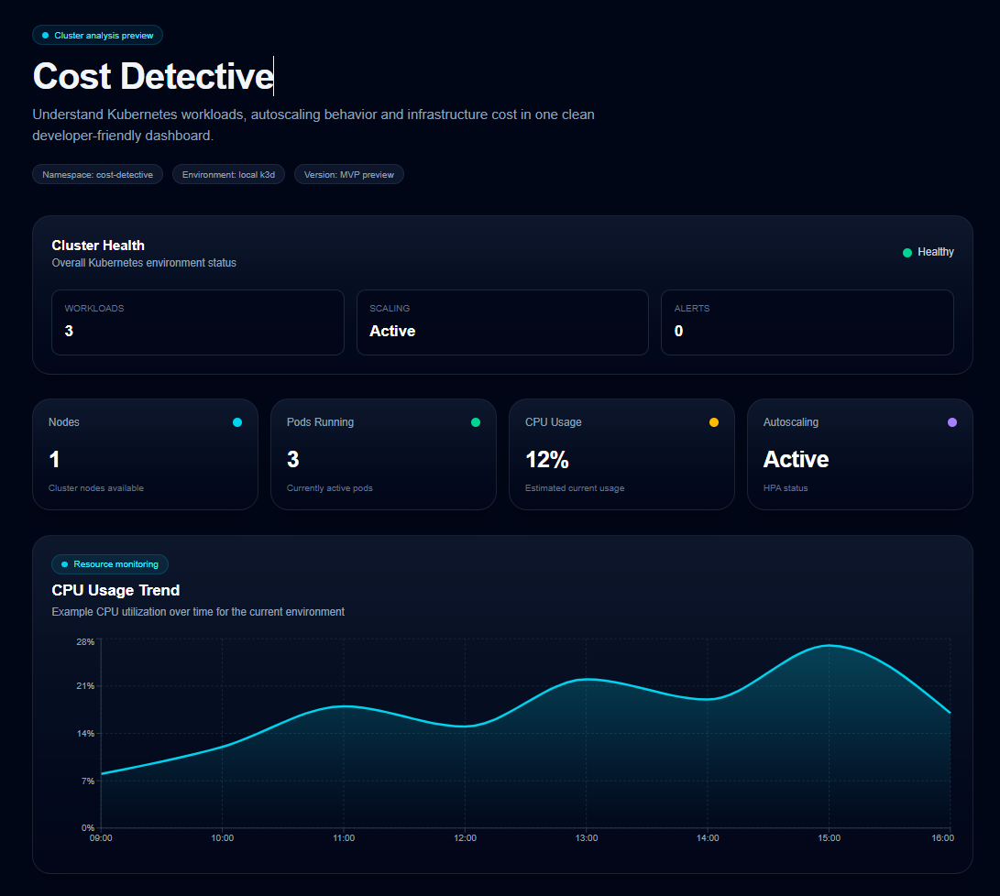
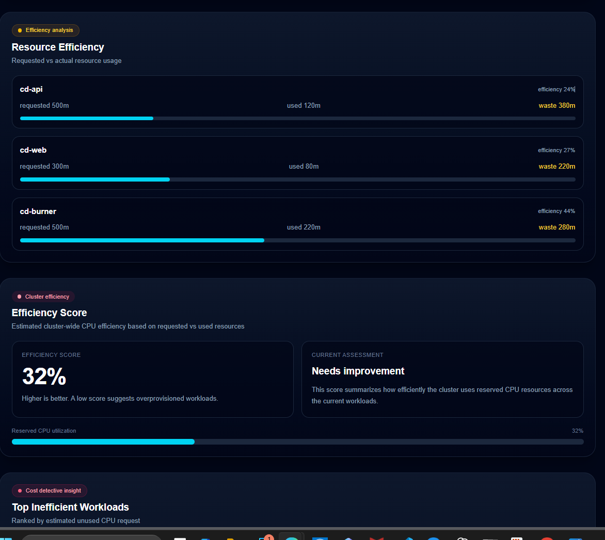

# Cost Detective

Cost Detective is a developer-friendly Kubernetes efficiency analysis dashboard.

The project helps platform engineers understand:

- Kubernetes workload behavior
- autoscaling configuration
- resource efficiency
- potential infrastructure cost waste

The goal is to visualize Kubernetes workloads and highlight inefficiencies that often remain hidden inside cluster metrics.

---

## Dashboard Preview

Cost Detective provides a clean dashboard for analyzing Kubernetes environments and identifying inefficient workloads.

The current dashboard visualizes:

- cluster health
- running workloads
- CPU usage trends
- Horizontal Pod Autoscaler configuration
- resource efficiency
- estimated infrastructure cost

⚠️ **Note**

This repository currently contains a **demo environment**.  
Some panels use example data to illustrate analysis concepts.

Future versions will integrate live Kubernetes metrics.

---

## Why This Project Exists

Kubernetes clusters often hide important operational insights behind raw metrics and infrastructure complexity.

Platform teams frequently struggle to answer questions such as:

- Which workloads actually use the resources they request?
- Is autoscaling configured correctly?
- Which services waste the most CPU or memory?
- Where can infrastructure costs be reduced?

Cost Detective aims to make these insights visible through a clean and developer-friendly dashboard.

---

## Features

### Resource Waste Analysis

One of the main goals of Cost Detective is to identify inefficient Kubernetes workloads.

The dashboard compares **requested resources** with **actual usage**.

Example:
requested CPU: 500m
actual CPU usage: 120m

This means **380m CPU are reserved but never used**.

Cost Detective highlights these inefficiencies and ranks workloads by potential waste.

Example output:

cd-api waste 76%
cd-web waste 63%
cd-burner waste 41%

This allows platform engineers to quickly identify workloads that can be optimized.

---

### Cluster Health Overview

Provides a quick overview of the Kubernetes environment.

Example metrics:

- number of running workloads
- autoscaling status
- alert indicators

---

### Workload Summary

Displays key cluster metrics such as:

- nodes
- running pods
- CPU usage
- autoscaling activity

---

### CPU Usage Trend

Visualizes cluster activity over time using a responsive chart.

This helps understand how the system behaves under load.

---

### Workload Details

Shows Kubernetes deployments and their estimated resource usage.

Displayed information includes:

- deployment name
- replicas
- CPU usage
- memory usage
- container image

---

### Horizontal Pod Autoscaler Overview

Displays autoscaling configuration.

Example values:

- minimum replicas
- maximum replicas
- current replicas
- CPU target threshold

---

### Resource Efficiency Analysis

Identifies resource waste across workloads.

Example insight:

requested CPU: 500m
used CPU: 120m
potential waste: 380m CPU

---

### Cost Insight (Preview)

Future versions will estimate infrastructure cost based on workload resource usage.

Planned features:

- cost per service
- cost per namespace
- potential savings from optimized resources

---

## Demo Environment

Cost Detective currently runs inside a local Kubernetes cluster.

Environment setup:

Laptop
→ k3d Kubernetes cluster

Cluster services:

cd-web Next.js dashboard
cd-api backend API for cluster metrics
cd-burner load generator for autoscaling tests

Infrastructure components:

- Kubernetes (k3d)
- Helm deployment
- Traefik ingress controller
- metrics-server
- Horizontal Pod Autoscaler

---

## Architecture

The project simulates a small Kubernetes platform environment.

Main components:

cd-web
Next.js dashboard

cd-api
Backend API that retrieves Kubernetes data

cd-burner
Workload generator used to simulate load

---

## Technology Stack

### Frontend

- Next.js
- TypeScript
- Tailwind CSS
- Recharts

### Infrastructure

- Kubernetes
- Helm
- k3d
- Traefik
- Horizontal Pod Autoscaler

---

## Project Structure

cost-detective
│
├ apps
│ └ api
│
├ dashboard
│ Next.js dashboard application
│
├ charts
│ Helm chart for Kubernetes deployment
│
├ docs
│ Project documentation and screenshots
│
└ README.md

---

## Running the Dashboard Locally

Navigate into the dashboard directory:

cd dashboard

Install dependencies:

npm install

Start the development server:

npm run dev

Open the dashboard:

http://localhost:3000/dashboard

---

## Roadmap

Current progress:

- Kubernetes deployment using Helm
- Horizontal Pod Autoscaler demo
- Dashboard MVP
- CPU usage chart
- resource efficiency panel

Planned improvements:

- live Kubernetes metrics integration
- resource waste alerts
- cost estimation per workload
- deployment event timeline
- multi-cluster support
- historical cluster analysis

---

## Learning Goals

This project explores topics such as:

- Kubernetes platform engineering
- infrastructure observability
- autoscaling behavior
- cost optimization strategies
- developer-focused infrastructure tools

---

## Project Status

Cost Detective is currently an experimental platform engineering project.

The dashboard UI and analysis logic are actively evolving.

---

## Author

Created as a learning and exploration project focused on Kubernetes infrastructure analysis and platform engineering.
