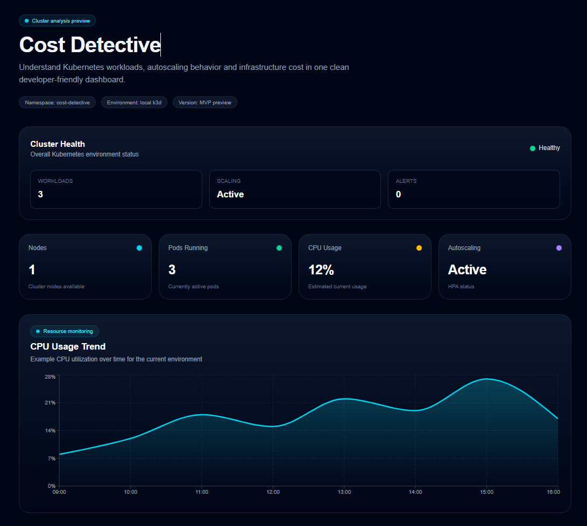
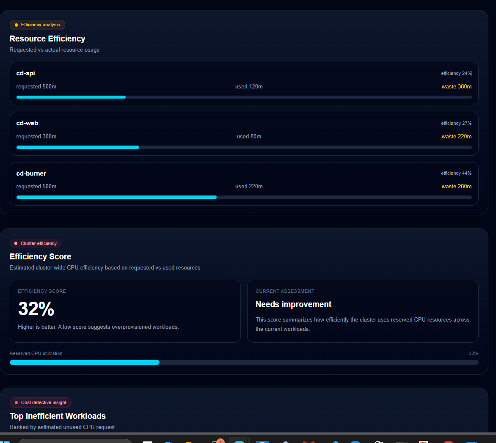

# Cost Detective


Cost Detective is a developer-friendly Kubernetes efficiency analysis dashboard.

The project helps platform engineers understand:

- Kubernetes workload behavior  
- autoscaling configuration  
- resource efficiency  
- potential infrastructure cost waste  

The goal is to visualize Kubernetes workloads and highlight inefficiencies that often remain hidden inside cluster metrics.

---

## 🚀 DevOps & Platform Engineering

This project demonstrates real-world DevOps practices:

- Multi-container architecture (Frontend + API + Database)  
- Docker-based local development  
- Docker Compose orchestration  
- PostgreSQL persistence (historical analysis)  
- CI pipeline using GitHub Actions  
- Automated Docker image build & publish (GHCR)  

---

## Dashboard Preview




Cost Detective provides a clean dashboard for analyzing Kubernetes environments and identifying inefficient workloads.

The current dashboard visualizes:

- cluster health  
- running workloads  
- CPU usage trends  
- Horizontal Pod Autoscaler configuration  
- resource efficiency  
- estimated infrastructure cost  

⚠️ **Note**

This repository currently contains a **demo environment**.  
Some panels use example data to illustrate analysis concepts.

Future versions will integrate live Kubernetes metrics.

---

## 🐳 Running Locally (Docker)

Start full stack:

```bash
docker compose up --build
